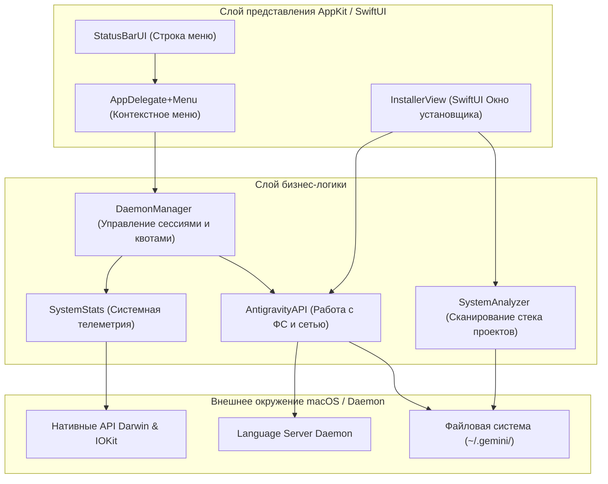

# Архитектура системы Antigravity Bar

Antigravity Bar спроектирован как легковесный клиент строки меню macOS («тонкий клиент»), работающий в связке с локальным демоном языкового сервера Antigravity. Основной фокус приложения — предоставление телеметрии в реальном времени и управление жизненным циклом AI-навыков без создания нагрузки на CPU и аккумулятор.

---

## Компоненты системы

Приложение разделено на несколько логических слоев:

### 1. Слой представления (UI Layer)
- **`StatusBarUI`**: отвечает за отрисовку кастомного текста и графических индикаторов (круговых диаграмм квот, графиков истории CPU/GPU/RAM) непосредственно в системной строке macOS.
- **`AppDelegate+Menu`**: управляет выпадающим AppKit-меню, обрабатывает клики пользователя, формирует списки активных аккаунтов и процессов, а также инициирует быстрые действия.
- **`InstallerView`**: SwiftUI-интерфейс менеджера пакетов, позволяющий выбирать, скачивать и устанавливать наборы AI-инструкций в зависимости от локального стека технологий.

### 2. Слой логики и служб (Service Layer)
- **`DaemonManager`**: центральный диспетчер состояния. Координирует опросы, переключает фокус между несколькими запущенными аккаунтами демонов, управляет адаптивным интервалом опроса (`Adaptive Polling`) и отправляет уведомления о исчерпании квот через `UNUserNotificationCenter`.
- **`AntigravityAPI`**: реализует взаимодействие с диском (подсчет и очистка кэша, папок `brain` и `conversations`) и отправку запросов Connect/Protobuf к локальному HTTP-порту демона.
- **`SystemStats`**: собирает метрики утилизации ресурсов хоста напрямую из ядра ОС (CPU/RAM/GPU).
- **`SystemAnalyzer`**: сканирует домашние директории на наличие установленных бинарников (`brew`, `cargo`, `node`) и анализирует структуру проектов в каталоге `~/Projects/` для автоматического подбора AI-профилей.

---

## Ключевые архитектурные решения

### 🛠 Безопасность и предотвращение зависаний (Daemon Discovery)
Для поиска запущенных экземпляров демона `language_server` приложение отказалось от запуска шелл-команд вроде `ps` или `pgrep`, так как блокировки ввода-вывода в терминале могут приводить к зависанию интерфейса macOS.
Вместо этого используется нативный C-interop с macOS:
1. Вызов `proc_listpids` для получения списка всех идентификаторов процессов (PID).
2. Вызов `proc_pidpath` для фильтрации процессов с именем `language_server`.
3. Чтение параметров запуска процессов из структуры `sysctl` (`KERN_PROCARGS2`) для безопасного извлечения токена авторизации (`--csrf_token`) и портов без обращения к командной строке.
4. Вызов `lsof` производится точечно через PID (`lsof -p <PID>`) исключительно для получения прослушиваемого HTTP-порта, если его не удалось определить из параметров запуска.

### 📦 Децентрализованный менеджер пакетов (JIT Skills)
Вся бизнес-логика AI-навыков вынесена из основного репозитория. Приложение сканирует локальный стек проекта (например, выявляет файлы `package.json` или `Cargo.toml`), обращается к локальному реестру `registry.json` и предлагает выборочно склонировать нужные Markdown-инструкции в папку `~/.gemini/antigravity/skills/`. Это сохраняет чистоту контекстного окна ИИ.

### 🔌 Изоляция файловой системы (FS Dependency Injection)
Для тестирования операций удаления данных и подсчета размера директорий используется протокол `SystemEnvironment`. Реальный код работает через `DefaultSystemEnvironment`, обертывающий методы `FileManager`, в то время как тесты используют `MockSystemEnvironment` с виртуальной файловой структурой.

---

## Используемые паттерны проектирования

1. **Singleton (Одиночка):** `AntigravityAPI.shared`, `DaemonManager.shared` и `SystemStats.shared` используются для глобального доступа к сервисам из любой точки приложения AppKit/SwiftUI.
2. **MVVM (Model-View-ViewModel):** Связка `InstallerView` и `InstallerViewModel` реализует реактивное обновление состояния интерфейса установки навыков.
3. **Dependency Inversion (Инверсия зависимостей):** Класс `AntigravityAPI` зависит от абстракции `SystemEnvironment`, а не от конкретного системного класса `FileManager`.
4. **Observer (Наблюдатель):** Callback-механизм `onUpdate` в `DaemonManager` уведомляет `AppDelegate` о необходимости перерисовки статусной строки при получении свежих данных телеметрии.
