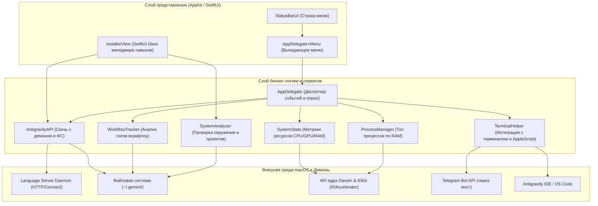

# Архитектура системы Antigravity Bar

Antigravity Bar спроектирован как высокопроизводительная, легковесная утилита строки меню macOS («тонкий клиент»), работающая совместно с локальным демоном языкового сервера Antigravity. Основной фокус приложения — предоставление телеметрии в реальном времени, управление лимитами использования ИИ и администрирование локальной базы знаний без нагрузки на CPU и аккумулятор устройства.

---

## 📂 Структура каталогов проекта

Проект организован в соответствии со стандартной структурой Swift Package Manager (SPM):

```
antigravity-status-bar/
├── Package.swift                     # Манифест сборки Swift Package Manager
├── wiki/                             # Документация проекта (База знаний)
│   ├── pages/                        # Подробные технические спецификации
│   ├── scripts/                      # Вспомогательные диагностические скрипты
│   └── index.md                      # Главное оглавление
└── status-bar/                       # Каталог исходного кода приложения
    ├── build-app.sh                  # Bash-скрипт сборки macOS .app бандла
    ├── Sources/
    │   └── AntigravityBar/           # Основной таргет приложения
    │       ├── main.swift            # Точка входа в приложение
    │       ├── AppDelegate.swift     # Делегат приложения, управление меню и событиями
    │       ├── AntigravityAPI.swift  # Взаимодействие с демоном и файловой системой
    │       ├── StatusBarUI.swift     # Логика отрисовки интерфейса строки меню
    │       ├── SystemStats.swift     # Сбор телеметрии ОС (CPU, GPU, RAM)
    │       ├── ProcessManager.swift  # Мониторинг процессов и потребления памяти
    │       ├── WorkflowTracker.swift # Анализ использования воркфлоу
    │       ├── TerminalHelper.swift  # AppleScript-интеграция, запуск CLI и VS Code
    │       ├── Analyzer.swift        # Анализатор установленного стека окружения
    │       ├── Environment.swift     # Абстракция файловой системы для тестов
    │       └── Resources/            # Info.plist, иконки приложения
    └── Tests/
        └── AntigravityBarTests/      # Набор модульных тестов
```

---

## 🏛 Логические слои и связи

Взаимодействие компонентов системы представлено на следующей схеме:



---

## 📄 Спецификация модулей (Swift-файлы)

### 1. `main.swift`
Является точкой входа в приложение. Инициализирует общий экземпляр `NSApplication.shared` и устанавливает политику активации `.accessory`. Это гарантирует, что утилита работает исключительно в строке меню, не отображает окно при запуске и не резервирует место в Dock-панели macOS. Назначает делегатом класс `AppDelegate` и запускает цикл обработки событий.

### 2. `AppDelegate.swift`
Центральный управляющий модуль. Выполняет следующие задачи:
- Инициализирует элемент `NSStatusItem` в системной строке меню.
- Реализует протокол `NSMenuDelegate` для динамической сборки сложного выпадающего меню с кастомными элементами (карточки аккаунтов, графики RAM, кнопки действий).
- Координирует фоновый опрос демонов (`Adaptive Polling`): каждые 10 секунд при закрытом меню и до получения свежих данных при открытии меню.
- Поддерживает мультиаккаунтинг, отслеживая состояние нескольких одновременно запущенных демонов (например, личного и корпоративного аккаунтов).
- Управляет отправкой локальных уведомлений (`UNUserNotificationCenter`) при исчерпании квот моделей.

### 3. `StatusBarUI.swift`
Отвечает за низкоуровневую отрисовку графических элементов непосредственно в текстовом поле `NSStatusItem.button`:
- Рисует круговой сектор таймера сброса квот (`makeTimerCircle`) на основе времени в секундах.
- Генерирует графики-спарклайны (`makeSparkline`) утилизации ресурсов хоста по массиву последних 20 измерений.
- Форматирует и компонует итоговую строку меню с применением цветового кодирования (зеленый/желтый/оранжевый/красный) в зависимости от критичности утилизации памяти, кэша и остатка квот.

### 4. `AntigravityAPI.swift`
Слой интеграции с демоном языкового сервера:
- **Daemon Discovery**: сканирует запущенные процессы macOS, отбирает те, что содержат имя `language_server`, считывает параметры их запуска через буферы ядра `sysctl` для безопасного извлечения `--csrf_token` и `--extension_server_port`.
- **Connect API Client**: совершает HTTP POST-запросы к локальному порту демона, передавая токен CSRF, парсит возвращаемый Connect-Protobuf JSON в типизированную структуру `CascadeUserStatus` и извлекает информацию о квотах моделей.
- **FS Operations**: выполняет подсчет размеров папок `brain/`, `conversations/`, `browser_recordings/` и производит их очистку.

### 5. `SystemStats.swift`
Модуль низкоуровневой системной телеметрии:
- **CPU**: вычисляет процент общей загрузки процессора с помощью `host_processor_info(PROCESSOR_CPU_LOAD_INFO)` путем сравнения разницы тактов (User, System, Nice, Idle) между итерациями опроса.
- **RAM**: считывает объем занятой памяти напрямую через `host_statistics64(HOST_VM_INFO64)`, суммируя страницы `active_count`, `wire_count` и `compressor_page_count`.
- **GPU**: опрашивает службы реестра ввода-вывода `IOKit` (сервисы с именем `IOAccelerator`) и считывает значение `Device Utilization %` или `GPU Activity`.

### 6. `ProcessManager.swift`
Обеспечивает мониторинг запущенных приложений в macOS:
- Вызывает C-функцию `proc_listpids` для получения списка всех процессов.
- Получает размер резидентной памяти (RSS) каждого процесса с помощью `proc_pidinfo(PROC_PIDTASKINFO)`.
- Группирует процессы по имени `.app` бандла, сортирует по объему потребления памяти и формирует топ-16 приложений.
- Предоставляет функцию `killProcess(pid:)` для принудительного завершения процессов отправкой сигнала `SIGTERM`.

### 7. `TerminalHelper.swift`
Утилитарный класс для интеграции с внешними программами и интерфейсами:
- Локализует CLI бинарники `antigravity-ide` или `antigravity` в ресурсах установленных приложений.
- Инициирует открытие нового чата в выбранной пользователем папке через CLI.
- В фоновом потоке обходит каталог `~/Projects`, находит все Git-репозитории, формирует локальный HTML-дашборд со ссылками вида `vscode://file/...` и открывает его в браузере.
- Запускает AppleScript-скрипты через `osascript` для отправки команд и текста непосредственно в активное окно Antigravity IDE (имитация ввода).

### 8. `WorkflowTracker.swift`
Мониторит использование сценариев автоматизации (воркфлоу):
- Сканирует файлы `.md` в папке `global_workflows/`.
- Выполняет поиск упоминаний этих сценариев (по шаблону `/[имя_воркфлоу]`) внутри текстовых логов `brain/*/.system_generated/logs/overview.txt`.
- Формирует статистику частоты вызова сценариев ИИ-агентом.
- Архивирует неиспользуемые сценарии (с нулевым количеством вызовов), перенося их в каталог `workflows_archive`.

### 9. `InstallerView.swift`
SwiftUI-компонент, реализующий интерфейс менеджера пакетов:
- Запускает процесс сканирования технологического стека.
- Позволяет пользователю в интерактивном древовидном списке выбрать Markdown-инструкции для последующей JIT-установки в системный каталог.
- Предоставляет настройки для управления источниками репозиториев (реестр `registry.json`).

### 10. `Analyzer.swift`
Содержит класс `SystemAnalyzer`, производящий диагностику хоста:
- Проверяет пути к исполняемым файлам `brew`, `git`, `node` и тулчейну `cargo` (Rust).
- Анализирует папки проектов в `~/Projects`, определяя используемый стек (например, наличие `package.json` детектирует Node/React проект, а `Cargo.toml` — Rust/Tauri проект).

### 11. `Environment.swift`
Объявляет протокол `SystemEnvironment`, который абстрагирует методы `FileManager` (содержимое папок, чтение данных, удаление, атрибуты). Реальный код выполняется через `DefaultSystemEnvironment`, а юнит-тесты подставляют `MockSystemEnvironment` с виртуальным деревом каталогов.

---

## 🔄 Ключевые архитектурные паттерны

1. **Singleton (Одиночка)**
   Сервисы, координирующие работу с аппаратурой и сетью (`AntigravityAPI.shared`, `SystemStats.shared`, `WorkflowTracker.shared`), реализованы как одиночки. Это исключает дублирование таймеров, повторный захват дескрипторов портов и избыточный расход памяти.

2. **Dependency Inversion (Инверсия зависимостей)**
   Класс `AntigravityAPI` инициализируется с зависимостью от протокола `SystemEnvironment`. Это позволяет абстрагировать дисковые операции от конкретной реализации файловой системы macOS, обеспечивая полную изолированность юнит-тестирования.

3. **MVVM (Model-View-ViewModel)**
   Интерфейс установки навыков (`InstallerView`) отделен от бизнес-логики с помощью реактивного класса `InstallerViewModel`. Модель представления отслеживает текущий шаг установки (`InstallerStep`), хранит дерево узлов (`Node`) и результаты системного отчета (`SystemReport`).

4. **Observer (Наблюдатель)**
   В `AppDelegate` настроен реактивный механизм обновления: при изменении активного демона изменяется свойство `api.baseDir`, что по цепочке запускает `didSet`-наблюдатель, инициирующий моментальный пересчет размера кэша и перерисовку строки меню.
